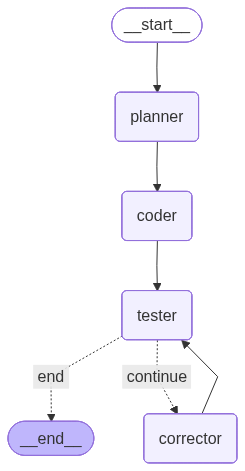

# Agent-as-Coder Challenge by Karbon
This project contains a fully autonomous AI agent designed to write, test, and debug Python code for parsing PDF bank statements. It leverages LangGraph to create a robust, cyclical workflow, allowing the agent to refine its own code until it meets the specified requirements.
## Agent Architecture
The agent follows a predetermined cycle of planning, execution, and self-correction, functioning as a state machine orchestrated using LangGraph. The process begins with a **Planner** node that creates a high-level plan for producing the required Python code for the parser. The **Coder** node then receives this plan, implements the strategy, and creates the initial parser version. The **Tester** node receives the generated code right away for verification against a sample CSV and PDF file. The state, along with the code and the particular error message, is sent to the **Corrector** node if the tests are unsuccessful, which analyzes the failure and generates a new, improved version of the code. This `generate → test → correct` loop continues until the tests pass or a set number of retries is exhausted, ensuring the agent can autonomously recover from its own errors.



### 5-Step Run Instructions
Follow these five steps to set up the environment and run the agent.
#### 1. Clone the Repository
Fork the project repository on GitHub and clone your fork to your local machine.
```
git clone https://github.com/JyotirmoyKonwar/ai-agent-challenge.git
cd ai-agent-challenge
```
#### 2. Set Up the Python Environment
Create and activate a virtual environment to manage project dependencies.# Create the environment
```
python -m venv venv
# or
uv venv

# Activate the environment
# On macOS/Linux:
source venv/bin/activate
# On Windows:
venv\Scripts\activate
```
#### 3. Install Dependencies
Install all the required Python libraries using the requirements.txt file.
```
pip install -r requirements.txt
# or
uv add -r requirements.txt
```
#### 4. Configure Your API Key
The agent requires a Groq API key to function.
1. Rename the `.env.example` file in the project's root directory to `.env`.
2. Open the new `.env` file and paste in your API key obtained from the Groq Console.
#### 5. Run the Agent and Validate with Pytest
First, run the agent to generate the parser. Then, run `pytest` to get the final validation.
```
# Step 5a: Run the agent to generate the code. Specify the Bank name and number of attempts the agent gets
python agent.py --target icici --retries 5

# Step 5b: Run pytest to validate the generated code
pytest
```
